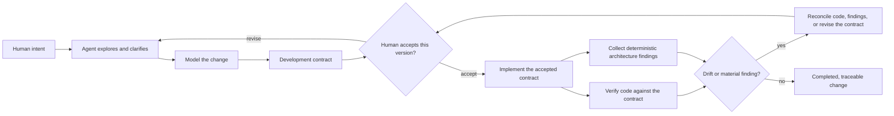
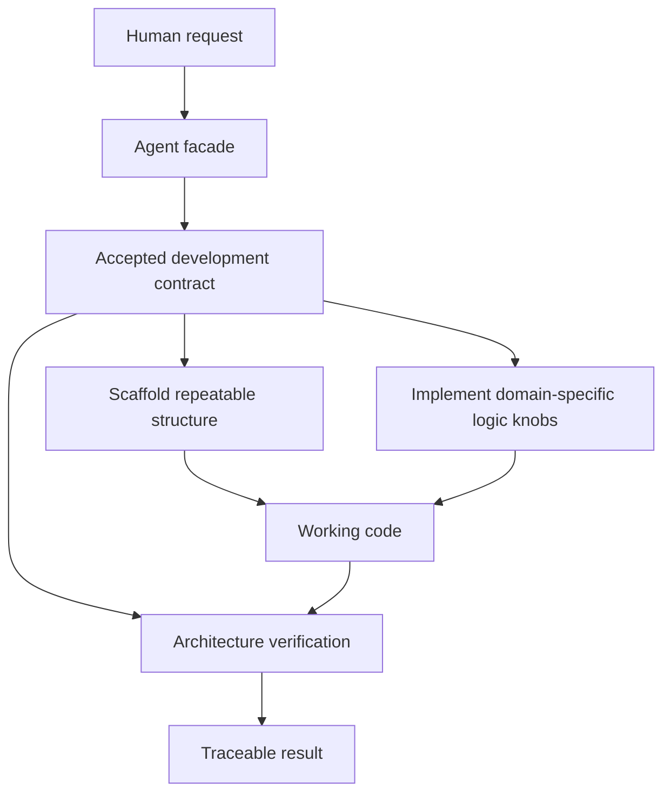

# Agent operating model

Part of the [Modwire agent architecture](../README.md) collection. Read the
[shared vocabulary](shared-vocabulary.md) alongside this document.

## Purpose

The Modwire agent turns a human request into an explicit architectural contract,
then implements only the contract the human has accepted. Its value is not
generic code generation: it makes intent, architecture, repeatable structure,
and the remaining problem-specific logic visible and reviewable.

The agent is a facade for this collaboration. It helps a human explore a
problem, formulate a design, build it, and check that the resulting code still
expresses the agreed design.

## The collaboration loop

The acceptance boundary is deliberate: before acceptance, the agent may
investigate and propose; after acceptance, it may implement the defined change.
If implementation discovers a material mismatch, the loop returns to the human
rather than silently changing the design.

## What a development contract expresses

Each contract describes a bounded change in terms that make both the human and
the agent able to reason about it:

- the user-visible use cases and their outcomes;
- the modules and architectural layers that own each responsibility;
- the domain concepts, application services, repositories, and external
  boundaries involved;
- repeatable structure that can be supplied by a scaffolding;
- the remaining **logic knobs**: the small, problem-specific decisions that
  cannot responsibly be reduced to a generic scaffold;
- the expected public signatures and structural relationships that can later be
  checked for drift.

The exact document shapes and diagram set are intentionally not fixed here.
They will be defined while we learn what makes a contract readable and useful.

## Architectural intent

Scaffoldings reduce repeated implementation work. They do not replace design:
the contract assigns ownership and names the logic that requires real judgment.
Architecture verification checks whether the code remains recognizably aligned
with that contract, including the agreed signatures where appropriate. In
parallel, deterministic topology analysis identifies hotspots, clusters,
export concentration, and other evidence that may reveal an architectural
question the contract did not yet express. Findings inform human judgment; they
are not automatic verdicts.

## Deferred concepts

**Enclosure** is intentionally deferred. It previously consumed capabilities
from `modwire-extraction`, but Modwire has absorbed part of that responsibility.
We will introduce it only if a concrete use case reveals a distinct role that
is not already served by the agent, contract, scaffoldings, or architecture
verification.

The Modwire service is the canonical home for development contracts and their
acceptance history. Exact persistence and transport details remain open.
Workspace attachment remains a separate, controlled capability and is not an
authority of the facade itself.
